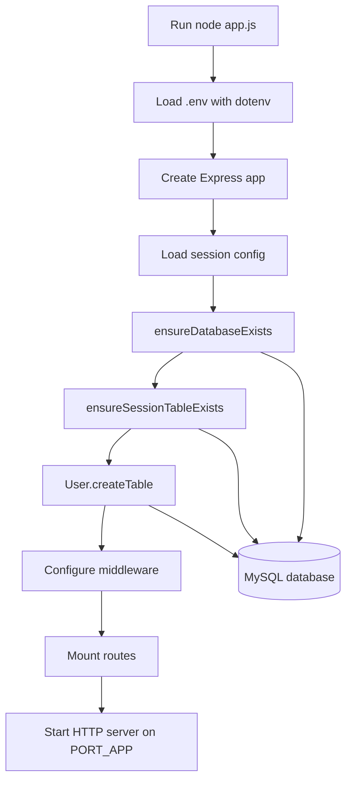
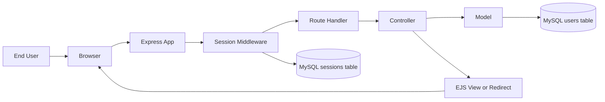
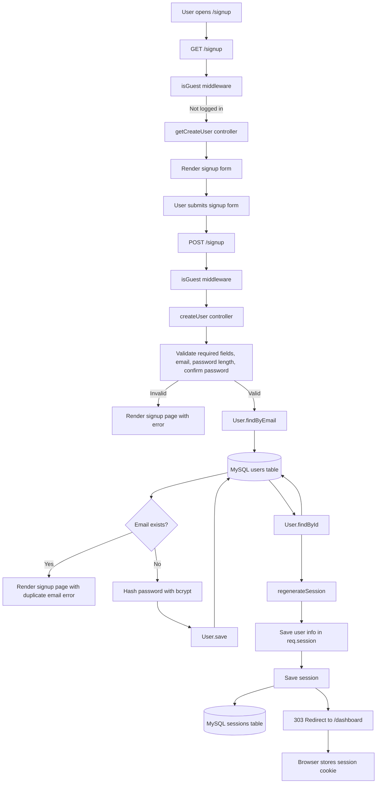
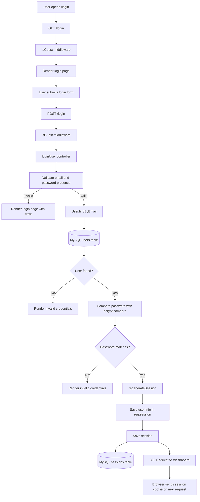
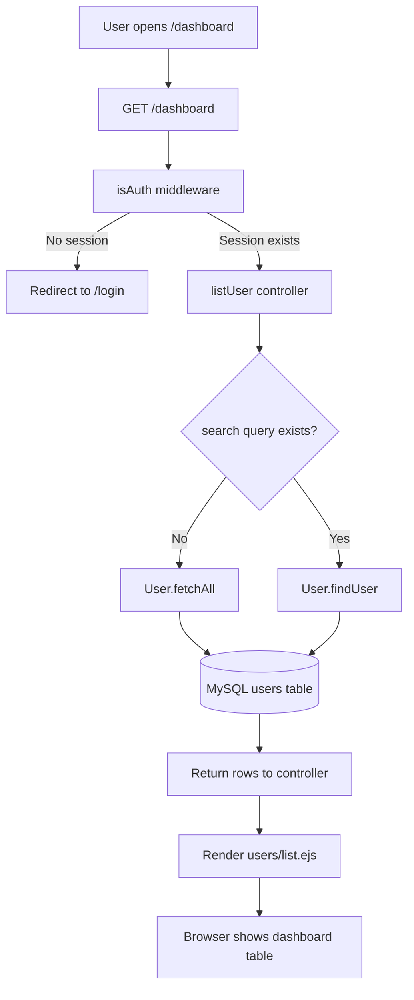
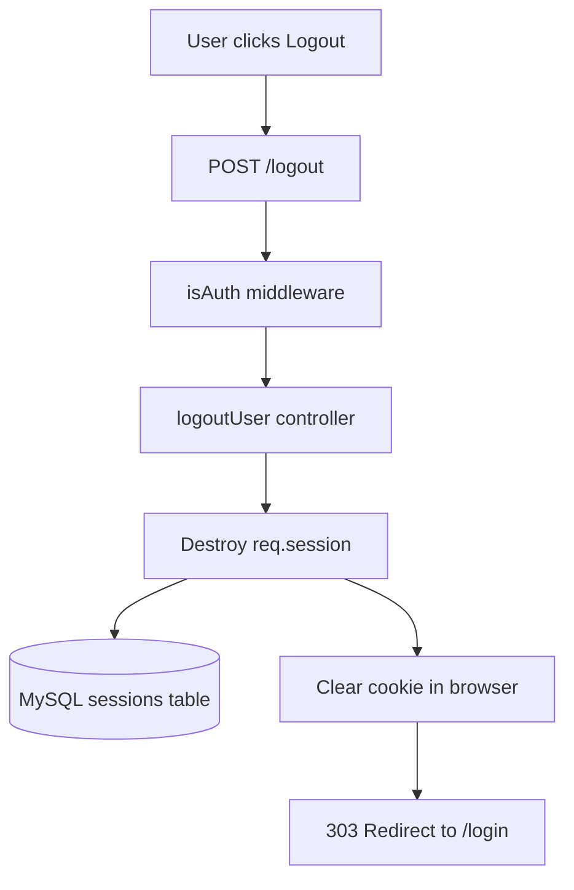
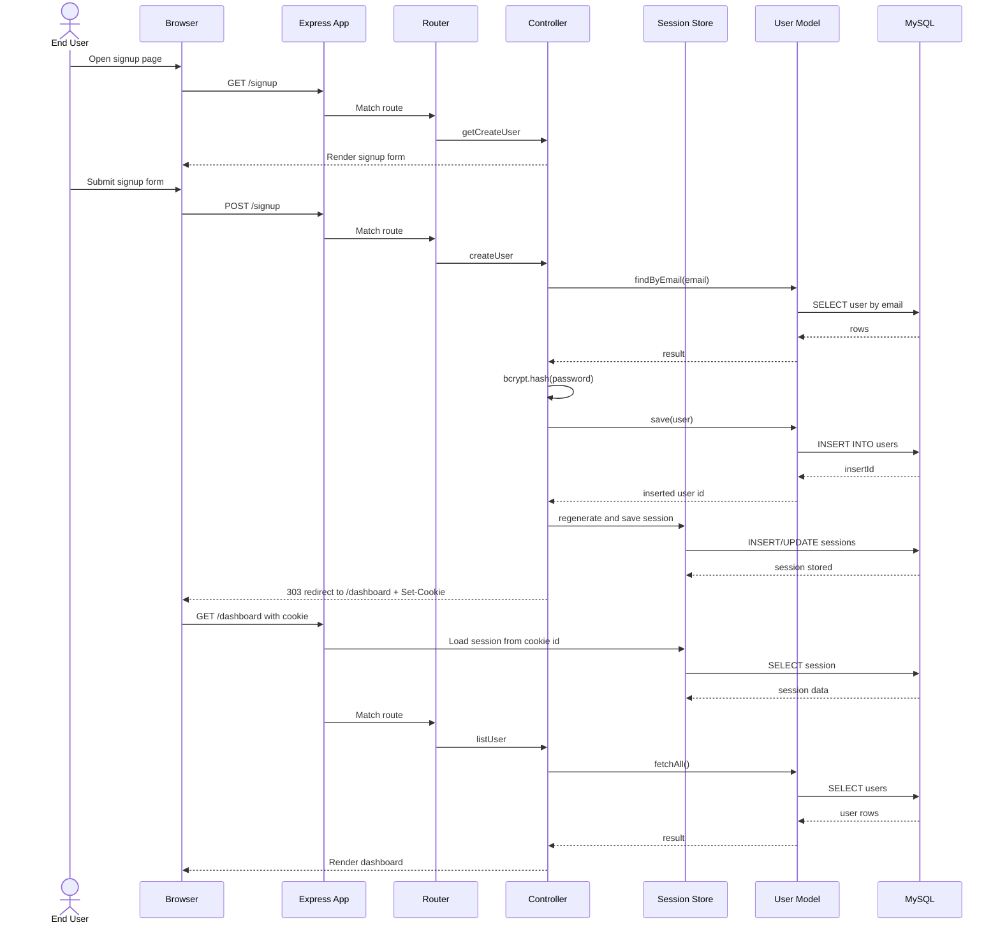

# Web Process Flowchart

This document simulates how this web app moves from the end user, through Express, into session storage and the MySQL database.

## Components

- End User: person using the site in a browser
- Browser: sends `GET` and `POST` requests and stores the session cookie
- Express App: `app.js` bootstraps middleware, routes, and views
- Router: `routes/userRoutes.js` maps URLs to controllers
- Controller: `controllers/userController.js` validates input and controls business logic
- Model: `models/userModel.js` performs parameterized SQL queries
- Session Store: `express-mysql-session` stores session data in the `sessions` table
- Database: MySQL database with `users` and `sessions` tables

## 1. Application Startup Flow

## 2. High-Level Request Flow

## 3. Signup Flow

## 4. Login Flow

## 5. Dashboard and Search Flow

## 6. Logout Flow

## 7. End-to-End Sequence

## Notes

- Passwords are never stored in plain text. They are hashed with `bcrypt`.
- Session state is not only in the browser cookie. The cookie stores the session id, while session data lives in MySQL.
- `isGuest` blocks logged-in users from visiting signup and login pages.
- `isAuth` blocks guests from visiting the dashboard and logout route.
- User reads and searches are parameterized in the model before reaching MySQL.
